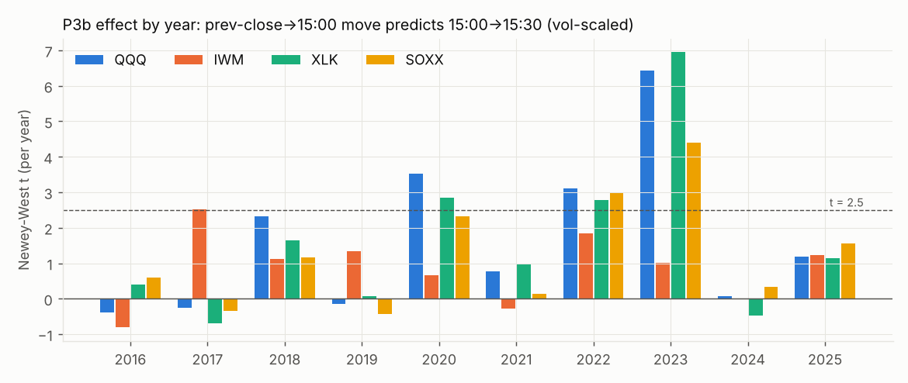
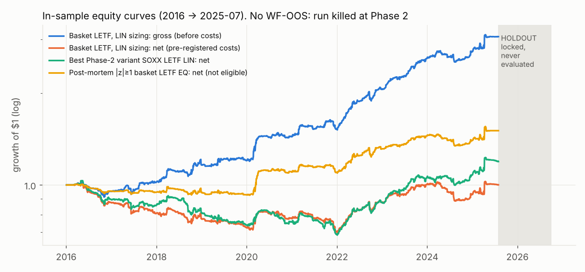
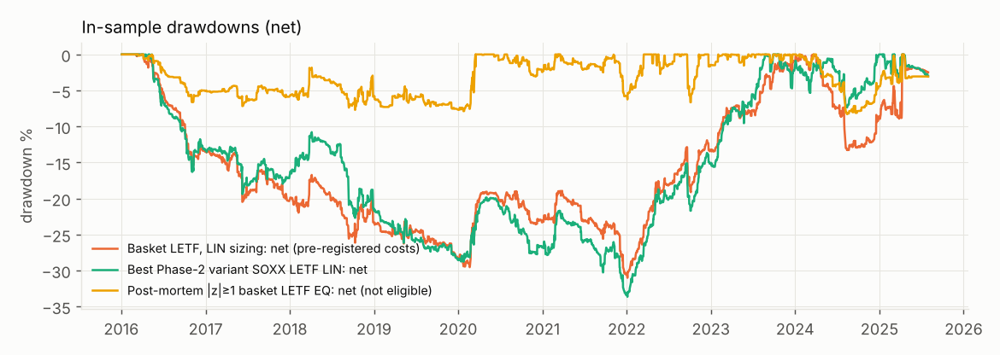
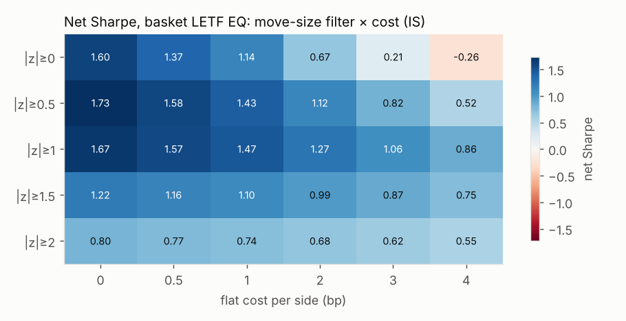
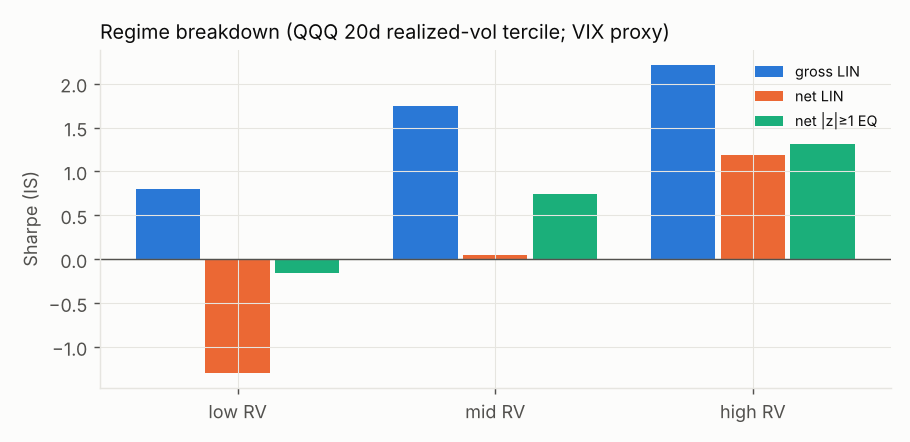

# Close-Flow Lab — Final Report

_Run date 2026-10-07 · branch `CLOSE_FLOW_LAB` · in-sample 2016-01-04 → 2025-07-31 · holdout 2025-08-01 → end of data (locked, never touched)_

## 1. Verdict

**KILL.** The best structural edge found is the **pre-close continuation**: the underlying's move from the previous close to 15:00 predicts 15:00→15:30, traded through the bull or bear LETF. It is statistically real in-sample (passed the Phase-1 gate on 4 underlyings and a falsification test on 21 untouched instruments), but it is **too small to survive trading costs**. Best net Sharpe is 0.28 with the pre-registered costs and 0.78 with quote-calibrated costs, against a gate of 1.0. **Holdout: not run.** Phase 2 failed with no pivots left, so the 12-month holdout stays clean for one future test.

## 2. Decision log (from `STATE.md`)

| Phase | Decision | Key evidence |
|---|---|---|
| 0 Data | **GO** (documented deviations) | 8 LETF↔underlying pairs on SIP data from 2016 (SOXL/SOXS–SOXX, TQQQ/SQQQ–QQQ, TNA/TZA–IWM, TECL/TECS–XLK). 39/39 splits handled. Close = 16:00-bar open (matches the SIP daily close to <1 bp). Downloads blocked by network policy, so no SPY/UPRO/SPXU/VIX and no data after Aug–Sep 2026. |
| 1 Effect (H1, H2) | **FAIL → PIVOT 1** | Gao et al. first-30→last-30 is absent (t −1.1…1.6). Day-move→last-60 (S7) passes only on SOXX. QQQ/XLK reach t≈2.6 but 2020 holds more than 50% of the effect. |
| Pivot 1: big-move days, no month-end | **FAIL → PIVOT 2** | Passes only on SOXX (t 2.72). QQQ/XLK fail on concentration in 2020 (61–63% of the effect). |
| Pivot 2: vol-scaled | **FAIL → PIVOT 3** | Passes only on SOXX (t 3.21). XLK t 2.80 and XBI t 2.85 fail year consistency. |
| Pivot 3: pre-imbalance window | **GO** | P3b (15:00→15:30) passes on QQQ 3.42, IWM 2.53, XLK 2.92, SOXX 3.15. Principled P3a (→15:50) passes only 2. Snooping concern refuted on 21 fresh instruments (20/21 positive, median t 1.53). |
| 2 Baseline | **FAIL → KILL** | 0/30 variants reach net SR>1.0 under any of three cost models. Pivots exhausted. |
| 3, FINAL | not run | — |

Each pivot was written into STATE.md **before** it was run, together with its structural reason (see STATE.md).

## 3. Key tables and charts

### Effect by year (P3b, Newey-West t per year)

The effect is carried by stress and trend years (2018, 2020, 2022, 2023). It is about zero in 2016, 2019, 2021 and **2024**, and 2025-H1 is mildly positive. Decay check on the last three IS years (t, 2023/2024/2025-H1): QQQ 6.42/0.06/1.20, XLK 6.95/−0.46/1.14, SOXX 4.40/0.34/1.55, IWM 1.02/−0.01/1.24.

### Where inside the last hour the drift happens (vol-scaled, x = prev close→15:00)
| window | QQQ | IWM | XLK | SOXX | XBI | NVDA | DIA |
|---|---|---|---|---|---|---|---|
| 15:00→15:30 | **3.42** | **2.53** | **2.92** | **3.15** | 2.29 | 1.67 | 1.33 |
| 15:30→15:45 | 1.20 | −0.22 | 1.01 | −0.08 | −1.02 | −1.44 | 0.13 |
| 15:45→15:55 | 0.77 | 0.29 | 1.30 | 2.48 | 4.05 | 2.61 | −0.89 |
| 15:55→close | 0.12 | 0.77 | 1.34 | 0.69 | 0.32 | 0.45 | −1.77 |

**The closing auction itself carries no continuation.** A MOC-exit design (the original Phase-2 spec) is buying noise in its last 30 minutes.

### Equity curves (IS only; there is no WF-OOS or holdout segment because the run stopped at Phase 2)

### Phase 2 (pre-registered costs → quote-calibrated costs)
| variant | gross SR | net SR (pre-reg) | net SR (calibrated) | PF (calibrated) |
|---|---|---|---|---|
| Basket LETF EQ | 1.60 | −0.46 | 0.24 | 1.05 |
| Basket LETF LIN | 1.57 | 0.04 | 0.56 | 1.16 |
| Basket underlying LIN | 1.46 | −0.15 | 0.33 | 1.09 |
| QQQ underlying LIN | 1.42 | 0.28 | 0.57 | 1.16 |
| SOXX LETF LIN | 1.69 | 0.28 | **0.78** | 1.22 |

Every variant beats the random-direction baseline at p<0.001, but none passes Sharpe>1.0 or PF>1.3. LETF vs underlying: the LETF version keeps more of the edge net of costs (about 3× the gross move for about 2–4× the cost) but has 2–3× the drawdown. Full grid: `reports/phase2/phase2_results*.csv`.

### Parameter / cost neighborhood (diagnostic)

The surface is smooth with no isolated peak. Net Sharpe stays above 1 only where |z| ≥ 0.5–1 and costs are ≤ 2–3 bp per side.

### Regime breakdown (VIX proxy = QQQ 20-day realized vol, causal)

| | low RV | mid RV | high RV |
|---|---|---|---|
| gross, basket LIN | 0.80 | 1.75 | 2.21 |
| net, basket LIN (pre-reg costs) | −1.29 | 0.05 | 1.18 |

The edge lives in elevated-vol regimes, consistent with a flow ∝ move mechanism.

## 4. Trials, deflated Sharpe, devil's advocate

- **Trials: 84 / 200** in `trials.csv`: 30 pre-registered Phase-2 variants, 30 re-runs with corrected costs, and 24 post-mortem diagnostics, all logged. Phase-1 effect specs (13) and the falsification run are not strategy trials and are listed in STATE.md.
- **Deflated Sharpe** (Bailey & López de Prado; N = 84, expected max Sharpe under the null ≈ 1.49 annualized):
  - best pre-registered (SOXX LETF LIN, SR 0.28): **DSR ≈ 0.0001**
  - same variant with calibrated costs (SR 0.78): DSR 0.013
  - best post-mortem lead (|z|≥1 basket, SR 1.07): DSR 0.08 — not significant.
- **Devil's-advocate findings and resolution:**
  1. *The close price is fake.* → The 16:00-bar open matches the SIP official close to <1 bp. Resolved.
  2. *S7 is just 2020.* → Confirmed; the gate rejected it (2020 share 52–57%).
  3. *P3b is circular (window chosen after looking).* → Tested on 21 never-seen instruments: 20/21 positive, median t 1.53, with semis strongest and gold/IBIT ≈ 0. Refuted, but in-sample t-stats are still biased upward.
  4. *The KILL is fake because costs are overstated.* → Partly true: I found and disclosed a calibration-reading error. With corrected costs, and even with half-spread-only costs, no variant reaches 1.0. The KILL stands.
  5. *A move-size filter would pass.* → It is post hoc (Phase-3 territory) and has DSR 0.08. Recorded as a lead, not a result.

## 5. Cost / slippage assumptions

- Spread estimator: Abdi-Ranaldo (2017) close/high/low on 1m bars (5m for SOXX/XBI/LABU/LABD) for 14:30–15:45, per day, floored at a 1-cent tick. Calibrated against SIP NBBO 1-second quotes (15:50–16:00, IS rows only): quoted/estimator = 0.85 (SOXL), 0.70 (SOXS).
- Pre-registered model: per side = 1.5 × half-spread + 0.5 bp. Calibrated model: per side = max(0.8 × half-spread, ½ tick) + 0.5 bp.
- Median pre-registered cost per side (bp): QQQ 1.0, IWM 1.0, XLK 1.5, SOXX 1.7, TQQQ 2.1, TECL 2.4, TNA 2.6, SOXL 3.6, TZA 4.5, SQQQ 4.9, TECS 5.9, SOXS 6.6 (`reports/phase2/cost_table.csv`).
- Fills: entry at the close of the 15:00 bar (1-minute latency after the 15:00 signal), exit at the close of the 15:30 bar, both by market order. No MOC is needed, so Alpaca's 15:50 MOC cutoff does not apply. SOXX underlying uses 5m bars, so its entry has no latency (slightly optimistic, and SOXX underlying variants failed anyway).

## 6. Correlation with OPEN-CLOSE-TRADE

Daily PnL correlation over IS days against the live strategies' honest-backtest series (`research/honest-backtest/reserve_daily.csv`, `baro_daily.csv`):

| Close-Flow series | Apex Reserve | Barometer (2022→) |
|---|---|---|
| SOXX LETF LIN | 0.085 | 0.033 |
| Basket LETF LIN | 0.078 | 0.051 |
| Basket LETF EQ, \|z\|≥1 | 0.106 (0.14 on both-active days) | 0.047 |

The correlation is near zero: the 15:00–15:30 sleeve would diversify your open-trading book, if it had a net edge.

## 7. Recommendation

- **Do not paper-trade or deploy** the rejected strategy (`configs/close_flow_preclose_continuation.yaml`, status `rejected`).
- **Do not repeat:** first-30→last-30 intraday momentum, any MOC-exit close-continuation, an underlying-only version (costs exceed the edge), or unconditional LETF basket versions. All are covered above.
- **The one lead worth a single clean test**: big-move pre-close continuation (|move to 15:00| ≥ 1σ60, LETF bull/bear, 15:01→15:31, no month-end; second document in the YAML, status `untested`). Its in-sample results with calibrated costs are SR 1.07, PF 1.43, MaxDD −7%, 7/10 years positive, DSR 0.08.
  - It only works if execution costs stay at or below about 2–3 bp per side, so use limit/peg-at-mid orders and preferably the liquid legs only (TQQQ, SOXL, TECL, TNA; avoid SOXS, TECS, SQQQ when the spread is wide).
  - The right next step is to **pre-register exactly that spec and run it once on the untouched holdout** (2025-08-01 →). If the holdout Sharpe is above 0.7, paper-trade it.
  - Suggested sizing for the paper test: equal notional ≤ 10% of equity per family in the LETF (≈30% underlying exposure each, up to 4 families on a big day), with a 1.5% daily loss cap on the sleeve. Expect about 1 trade per family per 4 days.
- **Data gaps to close before any rerun:** allow `data.alpaca.markets` in this environment's network policy and add Alpaca keys (env), then add SPY/UPRO/SPXU and a VIX/VIX3M source (CBOE). The realized-vol proxies used here are only a stand-in for VIX.

### Artifacts
`STATE.md` (full decision log), `trials.csv`, `configs/close_flow_preclose_continuation.yaml`, `data_inventory/`, `reports/phase1/*`, `reports/phase2/*`, `reports/figures/*`, `src/` (data layer with the holdout lock, features, backtester), `scripts/` (one script per phase; re-runnable, and trial logging is idempotent).
